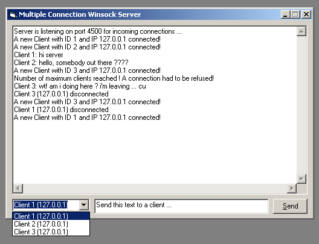



## \[\_a Multi Connection Winsock Server 1\.1\]

### Description

This is an easily portable Winsock Server which will accept multiple connections on one single port. The code is explained in detail and shouldn't be too hard to understand. You can change server port, number of maximum connections ...

If the maximum number of Clients is reached the server admin and new clients are informed about.

18.04.2003 Version 1.1 supports sending messages to all connected clients ;) thx to Jill for contacting me.
 
### More Info
 
You should know the basics about winsock applications.

             |
---                |---
**Submitted On**   |2003-01-18 22:27:48
**By**             |[over](https://github.com/Planet-Source-Code/PSCIndex/blob/master/ByAuthor/over.md)
**Level**          |Intermediate
**User Rating**    |4.7 (132 globes from 28 users)
**Compatibility**  |VB 5\.0, VB 6\.0
**Category**       |[Internet/ HTML](https://github.com/Planet-Source-Code/PSCIndex/blob/master/ByCategory/internet-html__1-34.md)
**World**          |[Visual Basic](https://github.com/Planet-Source-Code/PSCIndex/blob/master/ByWorld/visual-basic.md)
**Archive File**   |[\[\_a\_Multi\_1575694182003\.zip](https://github.com/Planet-Source-Code/over-a-multi-connection-winsock-server-1-1__1-42546/archive/master.zip)

